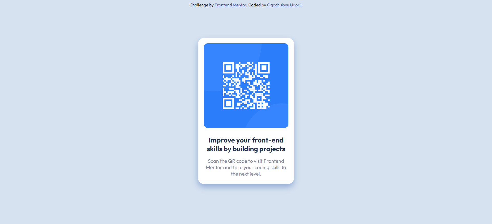

This is a Frontend Mentor challenge on qr-code component

## Overview
The  process of building this qr-code component was a little bit challanging. The reason was that I am a newbie in the frontend tech word, and I tried following the style guide in order to have the desired outcome but when I noticed that the font-size provided in the style guide was not giving me the desired outcome, I decided to make some little changes in order for the outcome to be the same with the one provided by Frontend Mentor.

### Screenshot

### Links

- Live Site URL: [Add live site URL here](https://your-live-site-url.com)

## My process
I used VS Code editor in building the QR code component. 
I first created the html file, and inside the file, I created a div with the class of qrCode-container which held all the divs which has the solution content in them. 
After that, I created a css file which I used in styling the project. All details of the codes I wrote can be seen in the html and css files.

### Built with

- Semantic HTML5 markup
- CSS custom properties

